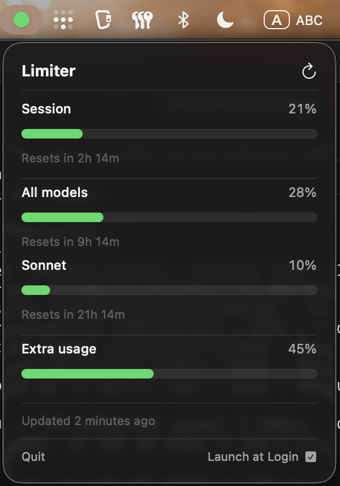

# Limiter

macOS menu bar app that shows your Claude Code usage limits at a glance.



## Features

- Color-coded menu bar icon (green/yellow/red) based on current usage
- Session (daily) and weekly limits with progress bars
- Sonnet-specific weekly limit tracking
- Extra usage tracking
- Time until reset (countdown or day+time for >24h)
- Auto-refresh every 5 minutes
- Launch at login support
- Reads OAuth token from macOS Keychain (same as Claude Code)

## Requirements

- macOS 14+
- Claude Code with active Pro/Max subscription (authenticated via `claude auth login`)

## Install

### Download

Grab the latest release from [**Releases**](https://github.com/Bergamolt/Limiter/releases/latest) — download `Limiter.zip`, unzip, and drag `Limiter.app` to `/Applications`.

### Build from source

```bash
git clone https://github.com/Bergamolt/Limiter.git
cd Limiter
make install
```

Requires Xcode Command Line Tools (`xcode-select --install`).

## Usage

The app runs as a menu bar icon. Click it to see your usage breakdown.

| Command | Description |
|---------|-------------|
| `make build` | Build the app |
| `make run` | Build and run locally |
| `make install` | Build and install to /Applications |
| `make uninstall` | Remove from /Applications |
| `make clean` | Remove build artifacts |

## How it works

Limiter calls the Anthropic OAuth usage API (`/api/oauth/usage`) using the same credentials that Claude Code stores in your macOS Keychain. No additional authentication needed.

## Uninstall

```bash
cd Limiter
make uninstall
```
